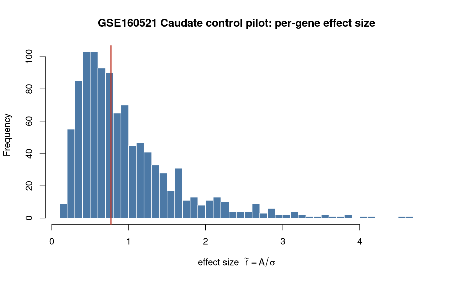
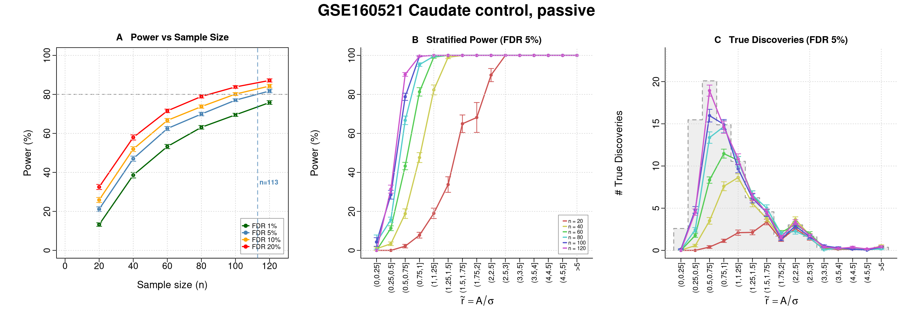
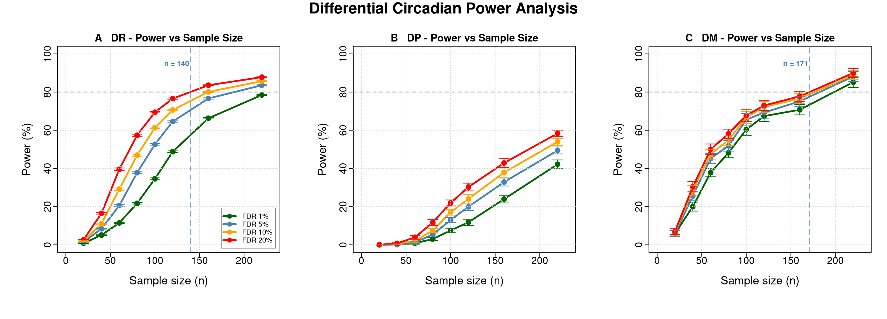
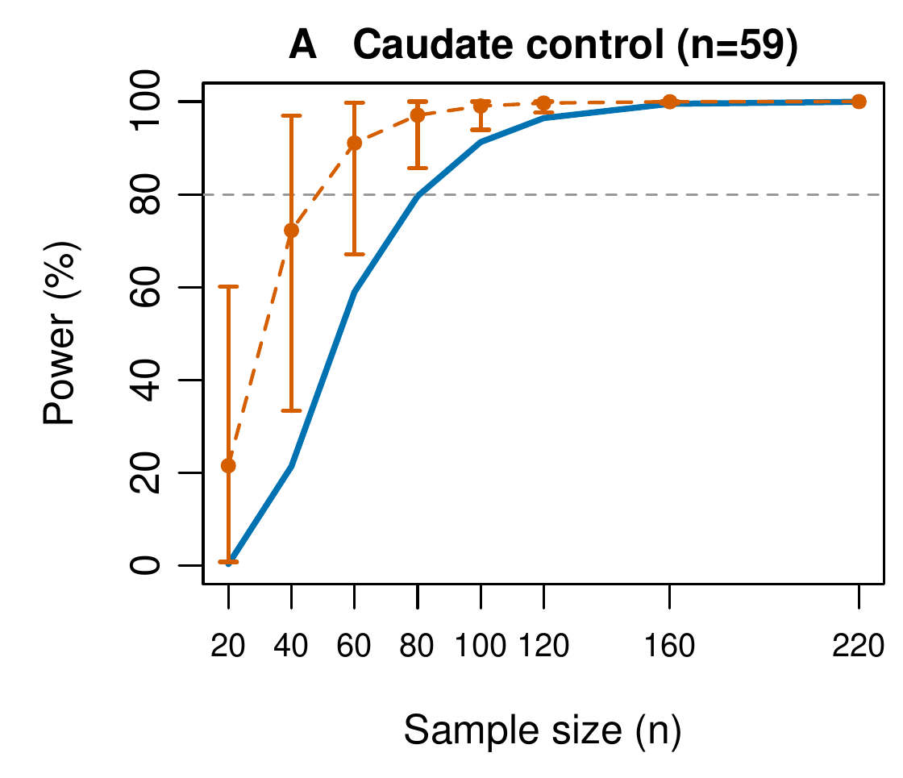
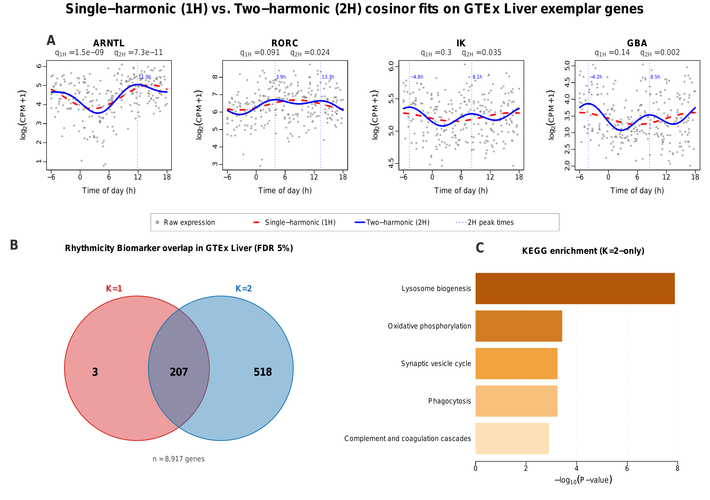
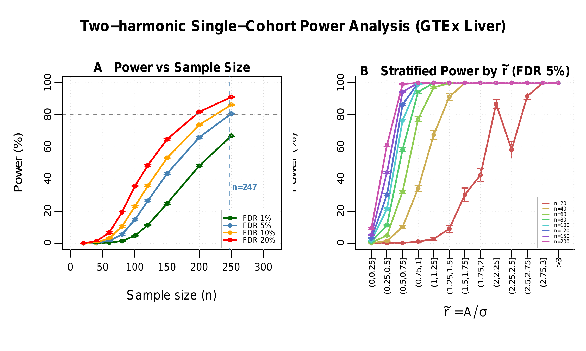
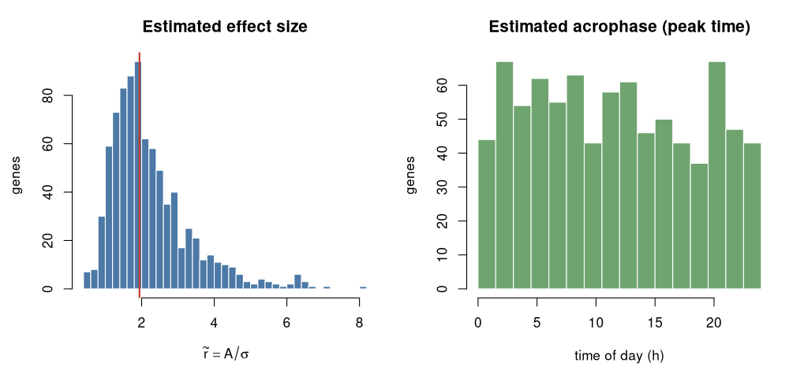
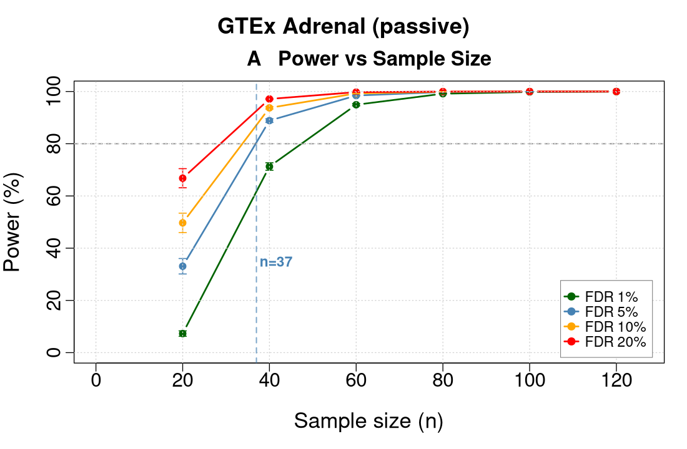

# SCP: Simulation-Based Circadian Power Analysis

[](https://opensource.org/licenses/MIT)
[](https://www.r-project.org/)

*How many samples, collected at what times of day, in which tissue, do you need
to find the genes that keep 24 hour time?*

## What SCP does

Circadian rhythms, the roughly 24 hour oscillations that regulate metabolism,
physiology, and disease, are carried by only a fraction of the transcriptome
([Takahashi 2017](https://doi.org/10.1038/nrg.2016.150)). Finding those genes,
or comparing their rhythms between conditions, takes enough samples collected
across enough times of day to separate a real rhythm from genome-wide noise, yet
circadian omics studies are usually short on samples. Established tools analyze
the data *after* it is collected: JTK_CYCLE and RAIN detect rhythms within a
condition ([Hughes 2010](https://doi.org/10.1177/0748730410379711); [Thaben
2014](https://doi.org/10.1177/0748730414553029)), while CircaCompare and
DiffCircaPipeline compare rhythms across conditions ([Parsons
2020](https://doi.org/10.1093/bioinformatics/btz730); [Xue
2023](https://doi.org/10.1093/bioinformatics/btad039)). None of them answer the
question that comes first: how many samples do you need? The one dedicated power
tool, CircaPower, assumes a single effect size shared by every rhythmic gene and
does not account for the multiple testing incurred when screening thousands of
genes at once ([Zong 2023](https://doi.org/10.1002/sim.9803)), assumptions that
rarely hold across real tissues and species.

SCP answers the sample-size question by simulation, calibrated to your own data.
You give it a small *pilot* dataset (a preliminary experiment in a comparable
tissue, or one of the 160+ pilots bundled with the package), and SCP learns from
that pilot how strong each gene's rhythm is, how noisy it is, and when during the
day samples were collected, capturing the transcriptome-wide spread of effect
sizes that a single fixed value cannot. It then simulates studies of many sizes
and reports how often each would succeed while holding the false discovery rate
at the level you choose. The result is a recommended number of samples for
**circadian biomarker detection** in one group, or for **differential
rhythmicity analysis** between two groups (differences in rhythmicity, phase, or
mesor). A bootstrap layer reports how sensitive that recommendation is to the
particular pilot you started from.

A few terms used throughout, in plain language. **Power** is the chance that a
study of a given size detects a gene that truly is rhythmic. **False discovery
rate (FDR)** is the share of the genes a study flags as rhythmic that are not
really rhythmic; you pick the level you are willing to tolerate (5 percent is
common), and SCP controls it with the Benjamini-Hochberg procedure (Benjamini
and Hochberg 1995). **Effect size** here is a gene's rhythm amplitude divided by
its noise, written `r_tilde = A / sigma`; larger means easier to detect.
**Noise (`sigma`)** is the gene-to-gene scatter of a gene's expression around its
cosinor fit, the residual variability SCP estimates per gene from the pilot (kept
on the log scale internally as `lOD`); a noisier gene is harder to detect at the
same amplitude. **Cosinor** is the standard model that fits a cosine wave to a
gene's expression over the day ([Cornelissen
2014](https://doi.org/10.1186/1742-4682-11-16)).

## Install

SCP is an R package. It depends on the Bioconductor package `limma`, so point
the installer at the Bioconductor repositories first.

```r
install.packages(c("remotes", "BiocManager"))
options(repos = BiocManager::repositories())   # resolves the Bioconductor dep 'limma'
options(timeout = 600)                          # bundled pilot data is about 100 MB
remotes::install_github("quythien/SCP", upgrade = "never", build_vignettes = TRUE)
library(SCP)
```

`build_vignettes = TRUE` builds the runnable tutorial so you can open it with
`browseVignettes("SCP")` after installing. If the GitHub download times out,
clone the repository and install from the local copy instead (`git` handles the
large download more reliably):

```r
# in a shell:  git clone https://github.com/quythien/SCP.git
options(repos = BiocManager::repositories())
remotes::install_local("SCP", upgrade = "never", build_vignettes = TRUE)
```

System requirements: R version 4.4.0 or newer and a C++ compiler (SCP uses Rcpp
and RcppArmadillo for the cosinor fit). On Linux: `apt install r-base-dev
libblas-dev liblapack-dev`. On macOS: `xcode-select --install`.

**macOS note (Fortran):** RcppArmadillo links against a Fortran and BLAS
toolchain, and CRAN R for macOS expects the official **gfortran** build. If the
install fails to compile with an error mentioning `gfortran`, `libgfortran`, or
`-lgfortran`, install the matching compiler from
<https://mac.r-project.org/tools/> (for R 4.4 on Apple Silicon or Intel this is
**gfortran 12.2-universal**, the file `gfortran-12.2-universal.pkg`), then retry
the install. This is a one time setup.

## Two ways to use SCP

**Point and click.** The bundled Shiny app runs the whole workflow in a browser
with no scripting. Install as above, then:

```r
SCP::launchShiny()
```

It runs entirely on your own machine. See the [Shiny app](#the-shiny-app)
section below for what the two halves of the app do.

**From R.** The rest of this page is the scripted API, which is what you want
for reproducible analyses.

## Quick start

Load a bundled pilot, set the study design, simulate, and read off the
recommended sample size.

```r
library(SCP)

# 1. Load a bundled pilot as a ready-to-use options object.
bio <- scp_load_pilot("human", "GTEx", "Adrenal", "All")

# Power is a proportion, so it barely depends on how many genes we simulate; we
# cap the gene count here only to keep this example fast. Drop this line for
# real runs.
bio$ngenes <- 1200

# 2. Describe the planned study: a range of total sample sizes, an active
#    design that collects samples every 4 hours over 24 hours (6 time points).
design   <- CircadianDesignOptions(sample_sizes = c(24, 36, 48, 72, 96),
                                   nsims  = 30,
                                   design = "active",          # or "passive"
                                   cts    = seq(0, 20, by = 4))
analysis <- CircadianAnalysisOptions(alpha = 0.05)

# 3. Simulate and score with the single-harmonic cosinor test (K = 1).
res <- runSimsSingleCohort(bio.opts      = bio,
                           design.opts   = design,
                           analysis.opts = analysis,
                           K             = 1,
                           mc.cores      = 4)

# 4. Smallest N reaching 80 percent power at FDR 5 percent.
npower(res, target_power = 0.80, fdr = 0.05)$n
#> [1] 33

# 5. Plot the power curve.
plotSingleCohortPower(res, fdr = 0.05)
```

## Setting up a run: the three options

Every power run combines three small settings objects. Keeping them separate lets
you change one thing at a time: the biology, the study, or the analysis.

**1. `bio` (the pilot).** What the biology looks like. Load a bundled pilot or
estimate one from your own data, then tune a field if you want.

```r
bio <- scp_load_pilot("human", "GTEx", "Adrenal", "All")   # or estCircadianParam(expr, tod)
bio$ngenes <- 1200                                        # fewer genes = faster
```

**2. `design` (the study).** Which sample sizes to try, how many simulations, and
the sampling design. This is where the active versus passive choice lives.

```r
# active: an animal study where you control the collection times
design <- CircadianDesignOptions(sample_sizes = c(24, 48, 72, 96), nsims = 100,
                                 design = "active", cts = seq(0, 20, by = 4))

# passive: a human post-mortem study where collection times cannot be controlled,
# so SCP draws them from the pilot's own time-of-day distribution (no cts needed)
design <- CircadianDesignOptions(sample_sizes = c(50, 100, 150, 200), nsims = 100,
                                 design = "passive")
```

**3. `analysis` (the inference).** The significance level, the multiple-testing
correction, and the FDR levels to report.

```r
analysis <- CircadianAnalysisOptions(alpha = 0.05, p.adjust.method = "BH",
                                     fdr_thresholds = c(0.05, 0.10, 0.20))
```

Then pass all three to a run function:

```r
res <- runSimsSingleCohort(bio, design, analysis, K = 1, mc.cores = 4)
```

For a bootstrap run you add a fourth object, `CircadianBootstrapOptions`; for a
two-group differential run, name the endpoints with `test_types = c("DR", "DP",
"DM")` in the design.

## Walkthrough with example outputs

The blocks below walk through the main analyses. Sections (a) through (d) and
(f) run end to end on data that ships with the package, and each figure is the
one the shown code produces (section (d) embeds the matching panel from the
manuscript). Section (e) is *illustrative*: it shows the exact two-harmonic
analysis and reports the numbers the paper reports, because the raw GTEx Liver
expression behind those figures is controlled-access and cannot be redistributed.

### a. Pick a pilot

The pilots differ in how strong their rhythms are, and that is what decides how
many samples you will need. Loading a pilot and looking at its effect-size
distribution (`r_tilde = A / sigma`, amplitude over noise, per gene) tells you
what you are working with before you simulate anything.

```r
cau  <- readRDS(system.file("extdata", "caudate_control_GSE160521.rds", package = "SCP"))
prep <- prepCircadianData(cau$expr, cau$times, input_type = "log2")
bio  <- estCircadianParam(prep$data, prep$times, period = 24)

r_tilde <- bio$amplitude / bio$sigma_rhythmic
hist(r_tilde, breaks = 40, col = "#4C79A6", border = "white",
     main = "GSE160521 Caudate control pilot: per-gene effect size",
     xlab = expression("effect size  " * tilde(r) == A / sigma))
abline(v = median(r_tilde), col = "#C0392B", lwd = 2)
```



### b. Single-cohort power

The core question for a one-group study: how many samples reach your target
power at your chosen FDR? SCP answers it two ways. The runnable examples in (b)
through (d) use control-region pilots (nucleus accumbens, caudate, and putamen)
from the public GSE160521 human striatal diurnal study ([Ketchesin
2021](https://doi.org/10.1073/pnas.2016150118)), bundled with the package; this
section loads the caudate control pilot.

```r
cau   <- readRDS(system.file("extdata", "caudate_control_GSE160521.rds", package = "SCP"))
prep  <- prepCircadianData(cau$expr, cau$times, input_type = "log2")
bio_c <- estCircadianParam(prep$data, prep$times, period = 24)
bio_c$ngenes <- 1200   # power is a proportion, so cap genes to keep the example fast
```

A quick closed-form estimate comes from `circaPowerApproxN80()`, the analytical
cosinor power formula (the approach behind CircaPower, [Zong
2023](https://doi.org/10.1002/sim.9803)) evaluated at the pilot's median effect
size. It is instant and needs no simulation:

```r
circaPowerApproxN80(bio_c, alpha = 0.05, target_power = 0.80)
#> [1] 40
```

The closed form assumes one effect size shared by every gene and ignores the
multiple testing across the transcriptome. The simulation drops both assumptions:
it draws the full spread of per-gene effect sizes from the pilot and controls the
FDR across all genes at once. `runSimsSingleCohort()` runs it over a grid of
sample sizes, and `npower()` reads off the recommended N:

```r
design   <- CircadianDesignOptions(sample_sizes = c(20, 40, 60, 80, 100, 120),
                                   nsims = 30, design = "passive", cts = prep$times)
analysis <- CircadianAnalysisOptions(alpha = 0.05,
                                     fdr_thresholds = c(0.05, 0.10, 0.20))

res <- runSimsSingleCohort(bio_c, design, analysis, K = 1, mc.cores = 4)

npower(res, target_power = 0.80, fdr = 0.05)$n
#> [1] 113
```

The passive design fits this pilot: collection times in a post-mortem cohort
cannot be controlled, so SCP draws them from the pilot's own time-of-day
distribution. The simulation lands far above the closed form (113 against 40),
because the weak-gene tail and the genome-wide FDR control, which the
single-number formula leaves out, both cost samples, and this striatal pilot
spans a broad range of effect sizes. That gap reflects the transcriptome-wide
effect-size heterogeneity a single-summary formula cannot capture but the
simulation does. Draw the panels straight from the pilot:

```r
plotSingleCohortPower(bio.opts = bio_c, design.opts = design,
                      analysis.opts = analysis, K = 1, mc.cores = 4,
                      title = "GSE160521 Caudate control, passive", fdr = 0.05)
```



Panel A is genome-wide power against sample size at several FDR levels, with the
dashed line at the recommended N. Panel B breaks that down by effect size
(`r_tilde = A / sigma`), so you can see which genes are within reach at a given N.
Panel C is the number of true rhythmic genes recovered in each band. Pass `panels
= "A"` for just the power curve; the legend sits in the bottom-right corner.

### c. Differential power (DR, DP, DM)

In a two-group study you often care less about the rhythms within either group
than about how those rhythms *differ* between them. SCP scores three kinds of difference:
**DR** (differential rhythmicity, a gene oscillates in one group but not the
other), **DP** (differential phase, it oscillates in both but its peak time
shifts), and **DM** (differential mesor, where the **mesor** is the rhythm
adjusted average expression level, so DM is a shift in that baseline).
`runDifferentialPower()` returns power for each, and `plotDiffPower()` draws them
side by side. Here we compare the caudate and putamen control pilots under a
passive design (times drawn from each region's own time-of-death distribution).
The two bundled matrices carry slightly different gene rosters, so match them to a
shared gene set before pairing:

```r
caudate <- readRDS(system.file("extdata", "caudate_control_GSE160521.rds", package = "SCP"))
putamen <- readRDS(system.file("extdata", "putamen_control_GSE160521.rds", package = "SCP"))
common  <- intersect(rownames(caudate$expr), rownames(putamen$expr))

bio_diff <- estCircadianParamTwoGroup(
  data_1  = caudate$expr[common, ], data_2  = putamen$expr[common, ],
  times_1 = caudate$times,          times_2 = putamen$times,
  paired_sigma = TRUE)
bio_diff$ngenes <- 3000   # power is a proportion, so cap genes to keep the example fast

design_d <- CircadianDesignOptions(
  sample_sizes = c(20, 40, 60, 80, 100, 120, 160, 220), nsims = 30,
  design = "passive", cts = caudate$times, test_types = c("DR", "DP", "DM"))

res_diff <- runDifferentialPower(bio_diff, design_d,
                                 CircadianAnalysisOptions(alpha = 0.05),
                                 methods = "DCP", test_types = c("DR", "DP", "DM"),
                                 mc.cores = 4, plot = FALSE)

# Recommended N per endpoint at 80 percent power, FDR 20 percent.
sapply(c("DR", "DP", "DM"),
       function(ep) npower(res_diff, 0.80, 0.20, endpoint = ep)$n)
#>  DR  DP  DM
#> 140  NA 171

plotDiffPower(list(res_diff), comp_labels = "Caudate vs Putamen (GSE160521 control)",
              endpoints = c("DR", "DP", "DM"), panel_fdr = 0.05, vline_fdr = 0.20)
```



Each column is one endpoint (DR, DP, DM). Within a column, the curves are
genome-wide power against per-group sample size N at four FDR levels (1, 5, 10,
and 20 percent), and the dashed line marks the N where power reaches 80 percent
at FDR 20 percent. The thing to take away is that telling two groups' rhythms
apart costs far more samples than finding rhythms in one group at the same effect
size: here differential rhythmicity needs about 140 samples per group and
differential mesor about 171, while differential phase is the most demanding
endpoint and stays below 80 percent power over the range examined (the `NA` in the
table), where a single-cohort scan of the same region needs far fewer.

To plan a study around a hypothesized effect instead of a real second group, set
the fractions of differing genes directly on the pilot object (`bio_diff$prop_DR`,
`$prop_DP`, `$prop_DM`) before simulating; the user guide vignette walks through
that.

### d. Bootstrap uncertainty

When the pilot itself is small, the recommended N is uncertain. SCP quantifies
that with Efron's subject bootstrap ([Efron
1979](https://doi.org/10.1214/aos/1176344552)): it resamples the pilot's subjects
with replacement many times, carrying each subject's collection time along with
its expression, and re-runs the whole estimate, so you can see how much the power
curve wobbles. `runBootstrapDesignGrid()` works from raw pilot expression, so this
example uses the caudate control pilot bundled with the package, a striatal cohort
of 59 subjects ([Ketchesin 2021](https://doi.org/10.1073/pnas.2016150118); GEO
accession GSE160521). The figure below is that pilot's panel from the manuscript
bootstrap figure.

```r
pilot <- readRDS(system.file("extdata", "caudate_control_GSE160521.rds",
                             package = "SCP"))
prep  <- prepCircadianData(pilot$expr, pilot$times, input_type = "log2")
bio_c <- estCircadianParam(prep$data, prep$times, period = 24)

boot_opts <- CircadianBootstrapOptions(design_vector = prep$times, B_values = 4,
                                       N_values = c(20, 40, 60, 80, 100, 120),
                                       nboot = 24, nsims_inner = 6,
                                       design = "passive", seed = 42)

boot <- runBootstrapDesignGrid(pilot_data = prep$data, pilot_times = prep$times,
                               boot.opts = boot_opts,
                               analysis.opts = CircadianAnalysisOptions(alpha = 0.05),
                               bio_diff.opts = bio_c, mode = "single",
                               methods = "DCP", mc.cores = 12)

plotBootstrapDesignGrid(boot, panels = "A")
```




The blue line is the point estimate (plug-in power); the orange line with error
bars is the bootstrap mean and its 95 percent confidence interval. With only 59
subjects to resample from, the band is wide and the bootstrap mean sits well above
the point estimate at small N (21 percent point estimate against a 72 percent
bootstrap mean at N = 40), while the point estimate reaches 80 percent power near
N = 80. A recommended sample size from a small pilot therefore carries real
uncertainty and should be treated with caution.

### e. Two-harmonic detection (K = 2)

Not every rhythmic gene follows a clean 24 hour cosine. Many transcripts carry a
second, 12 hour harmonic, an ultradian program documented across mammalian
tissues and in human liver, brain, and blood ([Hughes
2009](https://doi.org/10.1371/journal.pgen.1000442); [Zhu
2017](https://doi.org/10.1016/j.cmet.2017.05.004); [Scott
2023](https://doi.org/10.1371/journal.pbio.3001688); [Zhu
2024](https://doi.org/10.1038/s44323-024-00005-1)). A single-harmonic cosinor
test can miss these genes because their waveform departs from a simple sinusoid.
The two-harmonic detector (`K = 2`) adds the 12 hour component and recovers them,
at the cost of two extra degrees of freedom that slightly lower power on genes
that really are sinusoidal. You switch to it with one argument, `K = 2`, on the
same run function.

The two figures below are the manuscript GTEx Liver comparison. Liver has real 12
hour structure: at FDR 5 percent the single-harmonic test detects 210 rhythmic
genes and the two-harmonic test detects 725. Several clock and metabolic genes
(ARNTL, RORC, IK, GBA) are fit far better by the two-harmonic model (Panel A), the
two detectors share 207 discoveries while the two-harmonic detector adds 518 genes
the single-harmonic detector misses and loses only 3 (Panel B), and that added set
enriches for lysosome, oxidative-phosphorylation, and complement pathways (Panel
C).



GTEx raw expression is controlled-access, so the block below is illustrative: it
shows the two detectors side by side but does not run from the bundled package.

```r
# ILLUSTRATIVE (manuscript figure): raw GTEx Liver expression is controlled-access.
# expr / tod are the raw Liver matrix and its collection times.
bio_liver <- estCircadianParam(expr, tod, period = 24)
design    <- CircadianDesignOptions(
  sample_sizes = c(40, 80, 120, 160, 200, 250), nsims = 100, design = "passive")
analysis  <- CircadianAnalysisOptions(alpha = 0.05)

res    <- runSimsSingleCohort(bio_liver, design, analysis, K = 1, mc.cores = 4)
res_K2 <- runSimsSingleCohort(bio_liver, design, analysis, K = 2, mc.cores = 4)

data.frame(N        = design$sample_sizes,
           power_K1 = round(rowMeans(res$marginal_power,    na.rm = TRUE), 3),
           power_K2 = round(rowMeans(res_K2$marginal_power, na.rm = TRUE), 3))
#>     N power_K1 power_K2
#> 1  40    0.086    0.052
#> 2  80    0.421    0.284
#> 3 120    0.679    0.523
#> 4 160    0.812    0.662
#> 5 200    0.889    0.761
#> 6 250    0.947    0.812
```



The second figure is the two-harmonic power analysis: Panel A is genome-wide power
against N at several FDR levels, and Panel B stratifies power by first-harmonic
effect size. Because Liver carries genuine 12 hour structure, K = 2 recovers many
more rhythmic genes here (725 against 210); on a purely sinusoidal pilot K = 1
would be preferable, since the extra component only adds variance. The broader
target set costs sample size, though: reaching 80 percent genome-wide power takes
about N = 247 under K = 2 against about N = 154 under K = 1. The two-harmonic
model also needs at least 5 distinct sampling times per day to be identifiable
(K = 1 needs 3), so reach for it when your pilot or prior biology points to
non-sinusoidal structure and the sampling grid is dense enough.

### f. Use your own pilot

In practice you start from your own data: a gene by sample expression matrix and
a vector of collection times in hours. `prepCircadianData()` cleans and aligns
the inputs, and `estCircadianParam()` learns the pilot's rhythm parameters. Two
of those parameters are shown below: the per-gene effect size, and the
**acrophase** (the time of day at which each gene peaks). For a two-group pilot,
use `estCircadianParamTwoGroup()` instead.

```r
expr <- as.matrix(read.csv(
  system.file("extdata/example/example_expression.csv", package = "SCP"),
  row.names = 1, check.names = FALSE))
tod <- scan(system.file("extdata/example/example_tod.csv", package = "SCP"),
            what = double())

prep    <- prepCircadianData(expr, tod, input_type = "log2")
bio_own <- estCircadianParam(expr, tod, period = 24)

r_own <- bio_own$amplitude / bio_own$sigma_rhythmic
phase <- (bio_own$phase %% (2 * pi)) / (2 * pi) * 24   # radians to hours

par(mfrow = c(1, 2))
hist(r_own, breaks = 35, col = "#4C79A6", border = "white",
     main = "Estimated effect size", xlab = expression(tilde(r) == A / sigma))
hist(phase, breaks = seq(0, 24, by = 1.5), col = "#6FA46F", border = "white",
     main = "Estimated acrophase (peak time)", xlab = "time of day (h)")
```



`bio_own` now plugs into `runSimsSingleCohort()` exactly like a bundled pilot.
The shipped example is simulated data (designed to resemble a GTEx Adrenal pilot
so it is freely shareable); swap in your own `expr` and `tod` and nothing else
changes.

## The Shiny app

`launchShiny()` opens a browser app with two linked halves.

**Circadian Power Study** (left) is the sample-size calculator. Cascading
dropdowns pick a pilot (species, then dataset, then tissue, then condition), and
you set a rhythmicity threshold, the sampling design (active timecourse or
passive time-of-death), a grid of sample sizes, and sliders for target power and
FDR. Clicking *Run simulation* draws the power curve and the recommended sample
size. On launch the app opens on the GTEx Adrenal (passive) pilot.



**Circadian Biomarker Detection** (right) explores the pilot itself: a core
clock-gene cosinor panel, a ranked table of rhythmic genes with their FDR
adjusted p-values and effect sizes, a per-gene cosinor fit, and pathway
enrichment (KEGG, Reactome, GO). All 161 bundled pilots are available, and you
can also upload your own pilot (an expression-matrix CSV and a one-column
time-of-day CSV) and get the same analyses on your data. An example pair of
upload files ships with the package:

```r
system.file("extdata/example/example_expression.csv", package = "SCP")
system.file("extdata/example/example_tod.csv",        package = "SCP")
```

## Pilot database

SCP ships 161 public circadian transcriptomic pilots across human, baboon,
mouse, and rat, spanning more than 100 tissue contexts. Three accessors browse
and load them.

| Function | Use |
|---|---|
| `scp_pilots()` | Return the manifest as a data frame (species, dataset, tissue, condition, design, sample size, effect size, status) |
| `scp_pilot_search(query, species, tissue_pattern)` | Filtered search |
| `scp_load_pilot(species, dataset, tissue, condition)` | Load one pilot as a `CircadianBioOptions` object |

```r
scp_pilots()                                             # full manifest
scp_pilot_search(species = "human", tissue_pattern = "adrenal")
bio <- scp_load_pilot("human", "GTEx", "Adrenal", "All")
```

A per-pilot effect-size summary (median effect size, its spread, rhythmic-gene
counts at several FDR thresholds, and the time-of-day sampling pattern) lives at
`summary/tissue_signal_summary.csv`.

## Documentation

- Runnable tutorial: `browseVignettes("SCP")`, then open "Getting started with
  SCP", or the fuller "User Guide".
- Function reference: `?SCP`, or `help(package = "SCP")`, or the bundled
  `SCP-manual.pdf`.
- News and release notes: `NEWS.md`.

## References

- Benjamini Y, Hochberg Y. 1995. Controlling the false discovery rate: a practical and powerful approach to multiple testing. *Journal of the Royal Statistical Society: Series B* 57:289-300.
- Cornelissen G. 2014. Cosinor-based rhythmometry. *Theoretical Biology and Medical Modelling* 11:16. https://doi.org/10.1186/1742-4682-11-16
- Efron B. 1979. Bootstrap methods: another look at the jackknife. *Annals of Statistics* 7:1-26. https://doi.org/10.1214/aos/1176344552
- Hughes ME, DiTacchio L, Hayes KR, et al. 2009. Harmonics of circadian gene transcription in mammals. *PLoS Genetics* 5:e1000442. https://doi.org/10.1371/journal.pgen.1000442
- Hughes ME, Hogenesch JB, Kornacker K. 2010. JTK_CYCLE: an efficient nonparametric algorithm for detecting rhythmic components in genome-scale data sets. *Journal of Biological Rhythms* 25:372-380. https://doi.org/10.1177/0748730410379711
- Ketchesin KD, Zong W, Hildebrand MA, et al. 2021. Diurnal rhythms across the human dorsal and ventral striatum. *Proceedings of the National Academy of Sciences* 118:e2016150118. https://doi.org/10.1073/pnas.2016150118
- Parsons R, Parsons R, Garner N, Oster H, Rawashdeh O. 2020. CircaCompare: a method to estimate and statistically support differences in mesor, amplitude and phase, between circadian rhythms. *Bioinformatics* 36:1208-1212. https://doi.org/10.1093/bioinformatics/btz730
- Scott MR, Zong W, Ketchesin KD, et al. 2023. Twelve-hour rhythms in transcript expression within the human dorsolateral prefrontal cortex are altered in schizophrenia. *PLoS Biology* 21:e3001688. https://doi.org/10.1371/journal.pbio.3001688
- Takahashi JS. 2017. Transcriptional architecture of the mammalian circadian clock. *Nature Reviews Genetics* 18:164-179. https://doi.org/10.1038/nrg.2016.150
- Thaben PF, Westermark PO. 2014. Detecting rhythms in time series with RAIN. *Journal of Biological Rhythms* 29:391-400. https://doi.org/10.1177/0748730414553029
- Xue X, Zong W, Huo Z, et al. 2023. DiffCircaPipeline: a framework for multifaceted characterization of differential rhythmicity. *Bioinformatics* 39:btad039. https://doi.org/10.1093/bioinformatics/btad039
- Zhu B, Zhang Q, Pan Y, et al. 2017. A cell-autonomous mammalian 12 hr clock coordinates metabolic and stress rhythms. *Cell Metabolism* 25:1305-1319. https://doi.org/10.1016/j.cmet.2017.05.004
- Zhu B, Liu S, David NL, et al. 2024. Evidence for conservation of primordial 12-hour ultradian gene programs in humans under free-living conditions. *npj Biology of Timing and Sleep* 2:5. https://doi.org/10.1038/s44323-024-00005-1
- Zong W, Seney ML, Ketchesin KD, et al. 2023. Experimental design and power calculation in omics circadian rhythmicity detection using the cosinor model. *Statistics in Medicine* 42:3236-3258. https://doi.org/10.1002/sim.9803

## Citation

If you use SCP in your research, please cite:

```
Pham, T. Q. (2026). SCP: Simulation-Based Circadian Power Analysis.
  R package, latest version at https://github.com/quythien/SCP
```

A `CITATION.cff` is provided.

## License

MIT. See `LICENSE`.

## Contact

Issues and feature requests: <https://github.com/quythien/SCP/issues>
