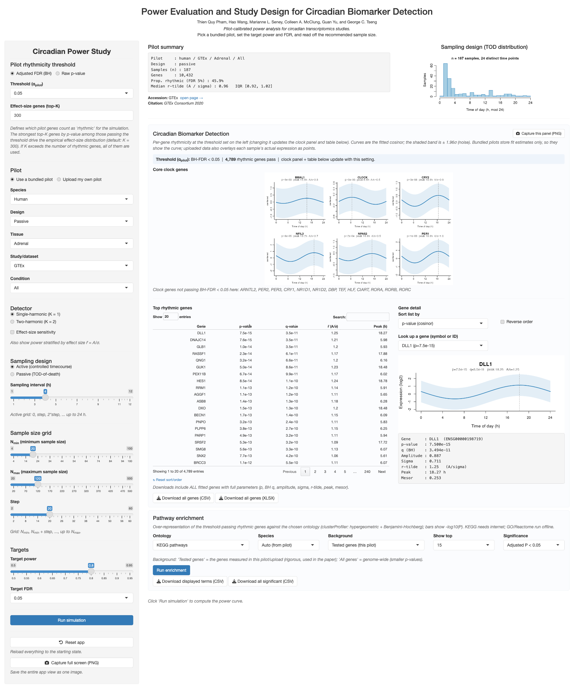

# SCP: Simulation-Based Circadian Power Analysis

[](https://opensource.org/licenses/MIT)
[](https://www.r-project.org/)

*How many samples, collected at what times of day and in which tissue, are needed to identify genes with 24-hour rhythmic expression?*

## Overview

Circadian rhythms, the approximately 24-hour oscillations that shape metabolism,
physiology, and disease, are present in only a subset of the transcriptome
([Takahashi 2017](https://doi.org/10.1038/nrg.2016.150)). Detecting those genes,
or comparing their rhythmic behavior across conditions, requires enough samples
distributed across the day to distinguish true rhythmicity from genome-wide
noise. In practice, however, circadian omics studies are often limited by sample
size. Existing methods are designed primarily for analysis after data collection:
JTK_CYCLE and RAIN detect rhythmicity within a single condition ([Hughes
2010](https://doi.org/10.1177/0748730410379711); [Thaben
2014](https://doi.org/10.1177/0748730414553029)), whereas CircaCompare and
DiffCircaPipeline compare rhythmic parameters between conditions ([Parsons
2020](https://doi.org/10.1093/bioinformatics/btz730); [Xue
2023](https://doi.org/10.1093/bioinformatics/btad039)). None of these methods
addresses the design question that arises first: how many samples are needed? The
one dedicated power tool, CircaPower, assumes a common effect size for all
rhythmic genes and does not account for the multiplicity burden that arises when
testing thousands of genes simultaneously ([Zong
2023](https://doi.org/10.1002/sim.9803)). Those assumptions are rarely realistic
for actual tissues or species.

SCP addresses sample-size planning through simulation calibrated to pilot data.
The user supplies a small pilot dataset, either from a preliminary experiment in
a comparable tissue or from one of the 160+ pilots distributed with the package.
SCP then estimates, for each gene, the strength of rhythmicity, the residual
noise, and the timing of sample collection, thereby capturing the transcriptome-wide
distribution of effect sizes rather than reducing it to a single summary value.
It next simulates studies across a range of sample sizes and quantifies the
probability of success while controlling the false discovery rate at the
user-specified level. The output is a recommended sample size for circadian
biomarker detection within one group or differential rhythmicity analysis between
two groups, including differences in rhythmicity, phase, or mesor. An optional
bootstrap layer quantifies how sensitive that recommendation is to the particular
pilot dataset used for calibration.

A few terms used throughout are worth defining explicitly. Power is the
probability that a study of a given size detects a gene that is truly rhythmic.
False discovery rate (FDR) is the expected proportion of genes declared rhythmic
that are in fact non-rhythmic; SCP controls FDR using the Benjamini-Hochberg
procedure (Benjamini and Hochberg 1995), with 5 percent as a common target.
Effect size is defined here as rhythmic amplitude divided by residual noise,
written `r_tilde = A / sigma`; larger values indicate genes that are easier to
detect. Noise (`sigma`) refers to the residual variability of a gene's
expression around its cosinor fit, estimated on a per-gene basis from the pilot
dataset and stored internally on the log scale as `lOD`. For a fixed amplitude,
noisier genes are harder to detect. Cosinor refers to the standard model that
represents gene expression over the day as a cosine function ([Cornelissen
2014](https://doi.org/10.1186/1742-4682-11-16)).

## Installation

SCP is an R package that depends on the Bioconductor package `limma`. Configure
installation to use the Bioconductor repositories first.

```r
install.packages(c("remotes", "BiocManager"))
options(repos = BiocManager::repositories())   # resolves the Bioconductor dependency 'limma'
options(timeout = 600)                         # bundled pilot data is about 100 MB
remotes::install_github("quythien/SCP", upgrade = "never", build_vignettes = TRUE)
library(SCP)
```

`build_vignettes = TRUE` builds the runnable tutorial so you can open it with
`browseVignettes("SCP")` after installing. If the GitHub download times out,
clone the repository and install from the local copy instead (`git` handles the
large download more reliably):

```r
# in a shell: git clone https://github.com/quythien/SCP.git
options(repos = BiocManager::repositories())
remotes::install_local("SCP", upgrade = "never", build_vignettes = TRUE)

```

System requirements are R 4.4.0 or newer and a C++ compiler, as SCP uses Rcpp and RcppArmadillo for cosinor fitting. On Linux, install r-base-dev, libblas-dev, and liblapack-dev.

On macOS, run xcode-select --install.

**macOS note (Fortran)**. RcppArmadillo links against a Fortran and BLAS toolchain, and CRAN R for macOS expects the official gfortran build. If installation fails with an error mentioning gfortran, libgfortran, or -lgfortran, install the matching compiler from https://mac.r-project.org/tools/. For R 4.4 on Apple Silicon or Intel, this is gfortran 12.2-universal (gfortran-12.2-universal.pkg). Then retry the installation. This is a one-time setup.

## Two ways to use SCP

SCP can be used either through the bundled Shiny app or directly from R.

**Point and click**: The bundled Shiny app runs the full workflow in a browser without requiring any scripting. After installation, launch it with:


```r
SCP::launchShiny()
```

The app runs entirely on your local machine. See the Shiny app section below for an overview of its two main components.

**From R**: The remainder of this page describes the scripted API, which is the recommended interface for reproducible analyses.


## Quick start

Load a bundled pilot dataset, define the study design, run the simulation, and obtain the recommended sample size.


```r
md
I made small wording changes in the comments only. The code itself is unchanged.

```r
library(SCP)

# 1. Load a bundled pilot as a ready-to-use options object.
bio <- scp_load_pilot("human", "GTEx", "Adrenal", "All")

# Power is a proportion, so it depends only weakly on the number of simulated
# genes. Cap the gene count here only to keep this example fast; remove this
# line in real analyses.
bio$ngenes <- 1200

# 2. Define the planned study: a range of total sample sizes and an active
#    design with samples collected every 4 hours over 24 hours (6 time points).
design   <- CircadianDesignOptions(sample_sizes = c(24, 36, 48, 72, 96),
                                   nsims  = 30,
                                   design = "active",          # or "passive"
                                   cts    = seq(0, 20, by = 4))
analysis <- CircadianAnalysisOptions(alpha = 0.05)

# 3. Run the simulation using the single-harmonic cosinor test (K = 1).
res <- runSimsSingleCohort(bio.opts      = bio,
                           design.opts   = design,
                           analysis.opts = analysis,
                           K             = 1,
                           mc.cores      = 4)

# 4. Smallest N reaching 80 percent power at FDR 5 percent.
npower(res, target_power = 0.80, fdr = 0.05)$n
#> [1] 33

# 5. Plot the power curve.
plotSingleCohortPower(res, fdr = 0.05)
```

## Setting up a run: the three options

Every power analysis combines three small settings objects. Keeping them
separate lets you change one component at a time: the biology, the study
design, or the analysis.

**1. `bio` (the pilot).** This object describes the biological signal. Load a
bundled pilot or estimate one from your own data, then modify individual fields
if needed.

```r
bio <- scp_load_pilot("human", "GTEx", "Adrenal", "All")   # or estCircadianParam(expr, tod)
bio$ngenes <- 1200                                         # fewer genes for a faster example run

```

**2. `design` (the study).**  This object defines the sample sizes to evaluate, the number of simulations to run, and the sampling design. This is where you choose
between active and passive sampling.

```r
# active: an animal study in which collection times are controlled
design <- CircadianDesignOptions(sample_sizes = c(24, 48, 72, 96), nsims = 100,
                                 design = "active", cts = seq(0, 20, by = 4))

# passive: a human post-mortem study in which collection times are not
# controlled, so SCP draws them from the pilot's time-of-day distribution
# (no cts needed)
design <- CircadianDesignOptions(sample_sizes = c(50, 100, 150, 200), nsims = 100,
                                 design = "passive")

```

**3. `analysis` (the inference).** This object defines the significance level, the
multiple-testing correction, and the FDR thresholds to report.


```r
analysis <- CircadianAnalysisOptions(alpha = 0.05, p.adjust.method = "BH",
                                     fdr_thresholds = c(0.05, 0.10, 0.20))

```

Then pass all three to a run function:

```r
res <- runSimsSingleCohort(bio, design, analysis, K = 1, mc.cores = 4)
```

For a bootstrap analysis, add a fourth object, CircadianBootstrapOptions. For a two-group differential analysis, specify the endpoints with test_types = c("DR", "DP", "DM") in the design.

## Worked examples 

The sections below walk through the main analyses. Sections (a) through (d) and
(f) run end to end on data that ships with the package, and each figure is
produced by the code shown (section (d) embeds the corresponding panel from the
manuscript). Section (e) is *illustrative*: it shows the exact two-harmonic
analysis and reports the values from the paper, because the raw GTEx Liver
expression underlying those figures is controlled-access and cannot be
redistributed.


### a. Pick a pilot

The pilots differ in how strong their rhythms are, and that is what decides how
many samples you will need. Loading a pilot and looking at its effect-size
distribution (`r_tilde = A / sigma`, amplitude over noise, per gene) tells you
what you are working with before you simulate anything.

```r
cau  <- readRDS(system.file("extdata", "caudate_control_GSE160521.rds", package = "SCP"))
prep <- prepCircadianData(cau$expr, cau$times, input_type = "log2")
bio  <- estCircadianParam(prep$data, prep$times, period = 24)

r_tilde <- bio$amplitude / bio$sigma_rhythmic
med     <- median(r_tilde, na.rm = TRUE)
hist(r_tilde, breaks = 40, col = "#4C79A6", border = "white",
     main = "GSE160521 Caudate control pilot: per-gene effect size",
     xlab = expression("effect size  " * tilde(r) == A / sigma))
abline(v = med, col = "#C0392B", lwd = 2)
text(med, par("usr")[4] * 0.9, bquote(median ~ tilde(r) == .(round(med, 2))),
     col = "#C0392B", pos = 4)
```


### b. Single-cohort power

The core question in a one-group study is: how many samples are needed to reach
the target power at a chosen FDR? SCP answers this in two ways. The runnable
examples in sections (b) through (d) use control-region pilots (nucleus
accumbens, caudate, and putamen) from the public GSE160521 human striatal
diurnal study ([Ketchesin
2021](https://doi.org/10.1073/pnas.2016150118)), bundled with the package. This
section uses the caudate control pilot.


```r
cau   <- readRDS(system.file("extdata", "caudate_control_GSE160521.rds", package = "SCP"))
prep  <- prepCircadianData(cau$expr, cau$times, input_type = "log2")
bio_c <- estCircadianParam(prep$data, prep$times, period = 24)
bio_c$ngenes <- 1200   # cap genes to keep the example fast
```

A quick closed-form estimate can be obtained with `circaPowerApproxN80()`, which
evaluates the analytical cosinor power formula used by CircaPower ([Zong
2023](https://doi.org/10.1002/sim.9803)) at the pilot's median effect size. It
is instantaneous and requires no simulation:

```r
circaPowerApproxN80(bio_c, alpha = 0.05, target_power = 0.80)
#> [1] 40
```

The closed-form approximation assumes a single effect size shared by all genes
and ignores multiple testing across the transcriptome. The simulation relaxes
both assumptions: it draws from the full distribution of per-gene effect sizes
estimated from the pilot and controls the FDR across all genes simultaneously.
`runSimsSingleCohort()` evaluates power over a grid of sample sizes, and
`npower()` returns the recommended N:


```r
design   <- CircadianDesignOptions(sample_sizes = c(20, 40, 60, 80, 100, 120),
                                   nsims = 30, design = "passive", cts = prep$times)
analysis <- CircadianAnalysisOptions(alpha = 0.05,
                                     fdr_thresholds = c(0.05, 0.10, 0.20))

res <- runSimsSingleCohort(bio_c, design, analysis, K = 1, mc.cores = 4)

npower(res, target_power = 0.80, fdr = 0.05)$n
#> [1] 113
```

The passive design is appropriate for this pilot: collection times in a
post-mortem cohort cannot be controlled, so SCP draws them from the pilot's own
time-of-day distribution. The simulation-based estimate is much higher than the
closed-form estimate (113 versus 40), because both the weak-effect tail and
genome-wide FDR control, which are omitted by the single-number approximation,
increase the required sample size. This striatal pilot spans a broad range of
effect sizes, and that gap reflects transcriptome-wide heterogeneity that a
single-summary formula cannot capture but the simulation can. The panels can be
generated directly from the pilot:


```r
plotSingleCohortPower(bio.opts = bio_c, design.opts = design,
                      analysis.opts = analysis, K = 1, mc.cores = 4,
                      title = "GSE160521 Caudate control, passive", fdr = 0.05)
```


Panel A shows genome-wide power as a function of sample size at several FDR
levels, with the dashed line marking the recommended N. Panel B stratifies power
by effect size (`r_tilde = A / sigma`), showing which genes are detectable at a
given N. Panel C shows the number of true rhythmic genes recovered in each
effect-size band. Pass `panels = "A"` to plot only the power curve; the legend
appears in the bottom-right corner.


### c. Differential power (DR, DP, DM)

In a two-group study, the main question is often not whether either group shows
rhythmicity on its own, but how the rhythms *differ* between groups. SCP
quantifies three types of difference: **DR** (differential rhythmicity, where a
gene oscillates in one group but not the other), **DP** (differential phase,
where a gene oscillates in both groups but peaks at different times), and
**DM** (differential mesor, where the **mesor** is the rhythm-adjusted mean
expression level, so DM reflects a shift in that baseline). `runDifferentialPower()`
returns power for each endpoint, and `plotDiffPower()` displays them side by
side. Here, we compare the caudate and putamen control pilots under a passive
design, with collection times drawn from each region's own time-of-death
distribution. Because the two bundled matrices contain slightly different gene
sets, first restrict them to the shared genes:


```r
caudate <- readRDS(system.file("extdata", "caudate_control_GSE160521.rds", package = "SCP"))
putamen <- readRDS(system.file("extdata", "putamen_control_GSE160521.rds", package = "SCP"))
common  <- intersect(rownames(caudate$expr), rownames(putamen$expr))

bio_diff <- estCircadianParamTwoGroup(
  data_1  = caudate$expr[common, ], data_2  = putamen$expr[common, ],
  times_1 = caudate$times,          times_2 = putamen$times,
  paired_sigma = TRUE)
bio_diff$ngenes <- 3000   # cap genes to keep the example fast

design_d <- CircadianDesignOptions(
  sample_sizes = c(20, 40, 60, 80, 100, 120, 160, 220), nsims = 30,
  design = "passive", cts = caudate$times, test_types = c("DR", "DP", "DM"))

res_diff <- runDifferentialPower(bio_diff, design_d,
                                 CircadianAnalysisOptions(alpha = 0.05),
                                 methods = "DCP", test_types = c("DR", "DP", "DM"),
                                 mc.cores = 4, plot = FALSE)

# Recommended N per endpoint at 80 percent power and FDR 20 percent.
sapply(c("DR", "DP", "DM"),
       function(ep) npower(res_diff, 0.80, 0.20, endpoint = ep)$n)
#>  DR  DP  DM
#> 140  NA 171

plotDiffPower(list(res_diff), comp_labels = "Caudate vs Putamen (GSE160521 control)",
              endpoints = c("DR", "DP", "DM"), panel_fdr = 0.05, vline_fdr = 0.20)

```


Each column corresponds to one endpoint (DR, DP, or DM). Within each column, the
curves show genome-wide power as a function of per-group sample size `N` at four
FDR levels (1, 5, 10, and 20 percent), and the dashed line marks the `N` at
which power reaches 80 percent at FDR 20 percent. The main point is that
detecting differences in rhythmicity between two groups requires substantially
more samples than detecting rhythmicity within a single group at a comparable
effect size. In this example, differential rhythmicity requires about 140
samples per group and differential mesor about 171, whereas differential phase
is the most demanding endpoint and does not reach 80 percent power over the
sample-size range examined (hence the `NA` in the table). By comparison, a
single-cohort scan of the same region requires far fewer samples.

To plan a study around a hypothesized effect rather than an observed second
group, set the fractions of differing genes directly on the pilot object
(`bio_diff$prop_DR`, `bio_diff$prop_DP`, and `bio_diff$prop_DM`) before running
the simulation. The user guide vignette provides a step-by-step example.


### d. Bootstrap uncertainty

When the pilot itself is small, the recommended sample size is uncertain. SCP
quantifies that uncertainty with Efron's subject bootstrap ([Efron
1979](https://doi.org/10.1214/aos/1176344552)): it resamples pilot subjects with
replacement, carrying each subject's collection time together with its
expression profile, and reruns the full estimation procedure. This shows how
much the power curve varies across bootstrap replicates. `runBootstrapDesignGrid()`
operates directly on raw pilot expression, so this example uses the caudate
control pilot bundled with the package, a striatal cohort of 59 subjects
([Ketchesin 2021](https://doi.org/10.1073/pnas.2016150118); GEO accession
GSE160521). The figure below reproduces the caudate panel from the manuscript's
bootstrap figure.
.

```r
pilot <- readRDS(system.file("extdata", "caudate_control_GSE160521.rds",
                             package = "SCP"))
prep  <- prepCircadianData(pilot$expr, pilot$times, input_type = "log2")
bio_c <- estCircadianParam(prep$data, prep$times, period = 24)

boot_opts <- CircadianBootstrapOptions(design_vector = prep$times, B_values = 4,
                                       N_values = c(20, 40, 60, 80, 100, 120),
                                       nboot = 40, nsims_inner = 20,
                                       design = "passive", seed = 42)

boot <- runBootstrapDesignGrid(pilot_data = prep$data, pilot_times = prep$times,
                               boot.opts = boot_opts,
                               analysis.opts = CircadianAnalysisOptions(
                                 alpha = 0.05, fdr_thresholds = 0.05),
                               bio_diff.opts = bio_c, mode = "single",
                               methods = "DCP", mc.cores = 12)

plotBootstrapDesignGrid(boot, panels = "A")
```

<p align="center"></p>


The blue line shows the point estimate (plug-in power). The orange dashed line
and shaded band show the bootstrap mean and its 95 percent confidence interval.
With only 59 subjects available for resampling, the interval is wide, and the
bootstrap mean lies well above the point estimate at small `N` (for example, a
42 percent point estimate versus an 86 percent bootstrap mean at `N = 40`).
Meanwhile, the point estimate does not reach 80 percent power until about
`N = 65`. A recommended sample size derived from a small pilot therefore carries
substantial uncertainty and should be interpreted with caution.


### e. Two-harmonic detection (K = 2)

Not every rhythmic gene follows a simple 24-hour cosine. Many transcripts also
carry a second, 12-hour harmonic, an ultradian pattern documented across
mammalian tissues and in human liver, brain, and blood ([Hughes
2009](https://doi.org/10.1371/journal.pgen.1000442); [Zhu
2017](https://doi.org/10.1016/j.cmet.2017.05.004); [Scott
2023](https://doi.org/10.1371/journal.pbio.3001688); [Zhu
2024](https://doi.org/10.1038/s44323-024-00005-1)). A single-harmonic cosinor
test can miss these genes because their waveforms depart from a simple sinusoid.
The two-harmonic detector (`K = 2`) adds the 12-hour component and can recover
them, at the cost of two additional degrees of freedom that slightly reduce
power for genes that are truly sinusoidal. You enable it by setting `K = 2` in
the same run function.

The two figures below show the manuscript's GTEx Liver comparison. Liver has
substantial 12-hour structure: at FDR 5 percent, the single-harmonic test
detects 210 rhythmic genes, whereas the two-harmonic test detects 725. Several
clock and metabolic genes (ARNTL, RORC, IK, and GBA) are fit much better by the
two-harmonic model (Panel A). The two methods share 207 discoveries, while the
two-harmonic detector adds 518 genes missed by the single-harmonic detector and
loses only 3 (Panel B). That additional set is enriched for lysosome,
oxidative-phosphorylation, and complement pathways (Panel C).


The example below is illustrative only. Reproducing this analysis requires
subject-level GTEx metadata, including collection-time information, which is
controlled-access and not distributed with the package.


```r
# ILLUSTRATIVE (manuscript figure): the subject-level GTEx metadata required to
# reproduce this Liver analysis, including collection-time information, are
# controlled-access.
# expr / tod are the raw Liver matrix and its collection times.
bio_liver <- estCircadianParam(expr, tod, period = 24)
design    <- CircadianDesignOptions(
  sample_sizes = c(40, 80, 120, 160, 200, 250), nsims = 100, design = "passive")
analysis  <- CircadianAnalysisOptions(alpha = 0.05)

res    <- runSimsSingleCohort(bio_liver, design, analysis, K = 1, mc.cores = 4)
res_K2 <- runSimsSingleCohort(bio_liver, design, analysis, K = 2, mc.cores = 4)

data.frame(N        = design$sample_sizes,
           power_K1 = round(rowMeans(res$marginal_power,    na.rm = TRUE), 3),
           power_K2 = round(rowMeans(res_K2$marginal_power, na.rm = TRUE), 3))
#>     N power_K1 power_K2
#> 1  40    0.086    0.052
#> 2  80    0.421    0.284
#> 3 120    0.679    0.523
#> 4 160    0.812    0.662
#> 5 200    0.889    0.761
#> 6 250    0.947    0.812


The second figure shows the two-harmonic power analysis. Panel A plots
genome-wide power against `N` at several FDR levels, and Panel B stratifies
power by first-harmonic effect size. Because Liver contains genuine 12-hour
structure, `K = 2` recovers many more rhythmic genes in this setting (725 versus
210). On a purely sinusoidal pilot, however, `K = 1` would generally be
preferable, because the extra component only adds variance. That broader target
set comes at a cost in sample size: reaching 80 percent genome-wide power
requires about `N = 247` under `K = 2`, compared with about `N = 154` under
`K = 1`. The two-harmonic model also requires at least 5 distinct sampling
times per day to be identifiable (`K = 1` requires 3), so it is most appropriate
when the pilot or prior biology suggests non-sinusoidal structure and the
sampling grid is sufficiently dense.


### f. Use your own pilot

In practice, you will usually start from your own data: a gene-by-sample
expression matrix and a vector of collection times in hours.
`prepCircadianData()` cleans and aligns these inputs, and `estCircadianParam()`
estimates the pilot's rhythm parameters. Two of those parameters are shown
below: the per-gene effect size and the **acrophase** (the time of day at which
each gene peaks). For a two-group pilot, use
`estCircadianParamTwoGroup()` instead.


```r
expr <- as.matrix(read.csv(
  system.file("extdata/example/example_expression.csv", package = "SCP"),
  row.names = 1, check.names = FALSE))
tod <- scan(system.file("extdata/example/example_tod.csv", package = "SCP"),
            what = double())

prep    <- prepCircadianData(expr, tod, input_type = "log2")
bio_own <- estCircadianParam(expr, tod, period = 24)

r_own <- bio_own$amplitude / bio_own$sigma_rhythmic
phase <- (bio_own$phase %% (2 * pi)) / (2 * pi) * 24   # radians to hours

par(mfrow = c(1, 2))
hist(r_own, breaks = 35, col = "#4C79A6", border = "white",
     main = "Estimated effect size", xlab = expression(tilde(r) == A / sigma))
hist(phase, breaks = seq(0, 24, by = 1.5), col = "#6FA46F", border = "white",
     main = "Estimated acrophase (peak time)", xlab = "time of day (h)")
```


`bio_own` can now be passed to `runSimsSingleCohort()` exactly like a bundled
pilot. The example shipped with the package uses simulated data, designed to
resemble a GTEx Adrenal pilot so that it can be shared freely; replace `expr`
and `tod` with your own data, and the workflow is otherwise unchanged.


## The Shiny app

`launchShiny()` opens a browser app with two linked panels.

**Circadian Power Study** (left) is the sample-size calculator. Cascading
dropdown menus let you select a pilot (species, then dataset, then tissue, then
condition), and you specify a rhythmicity threshold, the sampling design
(active time-course or passive time-of-death), a grid of sample sizes, and
target power and FDR using sliders. Clicking *Run simulation* generates the
power curve and the recommended sample size. On launch, the app opens to the
GTEx Adrenal (passive) pilot.




**Circadian Biomarker Detection** (right) explores the pilot itself: a core
clock-gene cosinor panel, a ranked table of rhythmic genes with FDR-adjusted
p-values and effect sizes, a per-gene cosinor fit, and pathway enrichment
analyses (KEGG, Reactome, and GO). All 161 bundled pilots are available, and
you can also upload your own pilot data—an expression-matrix CSV and a
one-column time-of-day CSV—to run the same analyses on your dataset. An example
pair of upload files ships with the package:


```r
system.file("extdata/example/example_expression.csv", package = "SCP")
system.file("extdata/example/example_tod.csv",        package = "SCP")
```

## Pilot database

SCP includes 161 public circadian transcriptomic pilots across human, baboon,
mouse, and rat, spanning more than 100 tissue contexts. Three accessors are
provided to browse and load them.


| Function | Use |
|---|---|
| `scp_pilots()` | Return the manifest as a data frame (species, dataset, tissue, condition, design, sample size, effect size, status) |
| `scp_pilot_search(query, species, tissue_pattern)` | Filtered search |
| `scp_load_pilot(species, dataset, tissue, condition)` | Load one pilot as a `CircadianBioOptions` object |

```r
scp_pilots()                                             # full manifest
scp_pilot_search(species = "human", tissue_pattern = "adrenal")
bio <- scp_load_pilot("human", "GTEx", "Adrenal", "All")
```

A per-pilot summary of effect-size characteristics—median effect size, its
spread, rhythmic-gene counts at several FDR thresholds, and the time-of-day
sampling pattern—is provided in `summary/tissue_signal_summary.csv`.


## Documentation

- Runnable tutorial: `browseVignettes("SCP")`, then open "Getting started with
  SCP", or the fuller "User Guide".
- Function reference: `?SCP`, or `help(package = "SCP")`, or the bundled
  `SCP-manual.pdf`.
- News and release notes: `NEWS.md`.

## References

- Benjamini Y, Hochberg Y. 1995. Controlling the false discovery rate: a practical and powerful approach to multiple testing. *Journal of the Royal Statistical Society: Series B* 57:289-300.
- Cornelissen G. 2014. Cosinor-based rhythmometry. *Theoretical Biology and Medical Modelling* 11:16. https://doi.org/10.1186/1742-4682-11-16
- Efron B. 1979. Bootstrap methods: another look at the jackknife. *Annals of Statistics* 7:1-26. https://doi.org/10.1214/aos/1176344552
- Hughes ME, DiTacchio L, Hayes KR, et al. 2009. Harmonics of circadian gene transcription in mammals. *PLoS Genetics* 5:e1000442. https://doi.org/10.1371/journal.pgen.1000442
- Hughes ME, Hogenesch JB, Kornacker K. 2010. JTK_CYCLE: an efficient nonparametric algorithm for detecting rhythmic components in genome-scale data sets. *Journal of Biological Rhythms* 25:372-380. https://doi.org/10.1177/0748730410379711
- Ketchesin KD, Zong W, Hildebrand MA, et al. 2021. Diurnal rhythms across the human dorsal and ventral striatum. *Proceedings of the National Academy of Sciences* 118:e2016150118. https://doi.org/10.1073/pnas.2016150118
- Parsons R, Parsons R, Garner N, Oster H, Rawashdeh O. 2020. CircaCompare: a method to estimate and statistically support differences in mesor, amplitude and phase, between circadian rhythms. *Bioinformatics* 36:1208-1212. https://doi.org/10.1093/bioinformatics/btz730
- Scott MR, Zong W, Ketchesin KD, et al. 2023. Twelve-hour rhythms in transcript expression within the human dorsolateral prefrontal cortex are altered in schizophrenia. *PLoS Biology* 21:e3001688. https://doi.org/10.1371/journal.pbio.3001688
- Takahashi JS. 2017. Transcriptional architecture of the mammalian circadian clock. *Nature Reviews Genetics* 18:164-179. https://doi.org/10.1038/nrg.2016.150
- Thaben PF, Westermark PO. 2014. Detecting rhythms in time series with RAIN. *Journal of Biological Rhythms* 29:391-400. https://doi.org/10.1177/0748730414553029
- Xue X, Zong W, Huo Z, et al. 2023. DiffCircaPipeline: a framework for multifaceted characterization of differential rhythmicity. *Bioinformatics* 39:btad039. https://doi.org/10.1093/bioinformatics/btad039
- Zhu B, Zhang Q, Pan Y, et al. 2017. A cell-autonomous mammalian 12 hr clock coordinates metabolic and stress rhythms. *Cell Metabolism* 25:1305-1319. https://doi.org/10.1016/j.cmet.2017.05.004
- Zhu B, Liu S, David NL, et al. 2024. Evidence for conservation of primordial 12-hour ultradian gene programs in humans under free-living conditions. *npj Biology of Timing and Sleep* 2:5. https://doi.org/10.1038/s44323-024-00005-1
- Zong W, Seney ML, Ketchesin KD, et al. 2023. Experimental design and power calculation in omics circadian rhythmicity detection using the cosinor model. *Statistics in Medicine* 42:3236-3258. https://doi.org/10.1002/sim.9803

## Citation

If you use SCP in your research, please cite:

```
Pham, TQ. (2026). SCP: Simulation-Based Circadian Power Analysis.
  R package, latest version at https://github.com/quythien/SCP
```

A `CITATION.cff` is provided.

## License

MIT. See `LICENSE`.

## Contact

Issues and feature requests: <https://github.com/quythien/SCP/issues>
