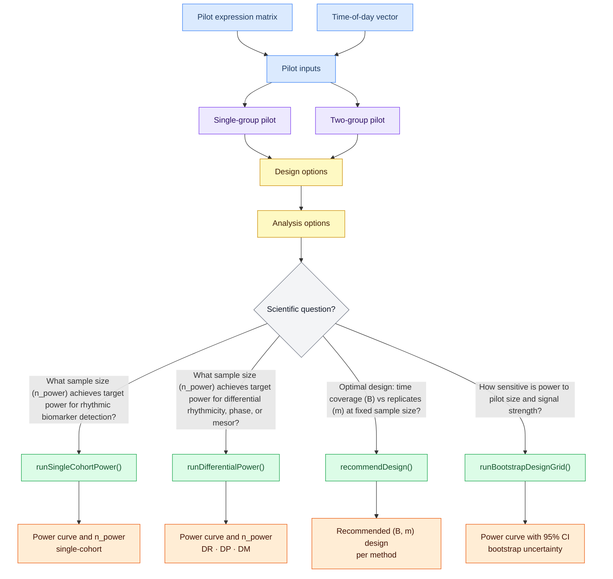

# SCP: Semiparametric Circadian Power — User Guide

**Author:** Thien Pham  
**Package:** SCP (Semiparametric Circadian Power)  
**Repository:** [DiffCircaPower](https://github.com/quythien/DiffCircaPower)

---

## Table of Contents

1. [Overview](#1-overview)
2. [Pipeline Flowchart](#2-pipeline-flowchart)
3. [Quick Start](#3-quick-start) — including data format requirements
4. [Single-Cohort Power](#4-single-cohort-power)
5. [Differential Power](#5-differential-power)
6. [B vs m Trade-off and Method Recommendation](#6-b-vs-m-trade-off-and-method-recommendation)
7. [Bootstrap Uncertainty](#7-bootstrap-uncertainty)
8. [Working with Result Objects](#8-working-with-result-objects)
9. [Complete Publication Example](#9-complete-publication-example)
10. [Function Reference](#10-function-reference)

---

## 1. Overview

**SCP** is an R framework for transcriptome-wide power analysis of circadian rhythm studies. It addresses four questions:

| Question | Function |
|----------|----------|
| How many samples to detect rhythmic genes in one group? | `runSingleCohortPower()` |
| How many samples per group to detect DR / DP / DM? | `runDifferentialPower()` |
| Given fixed N, how to spread across time points vs replicates? | `recommendDesign()` |
| How wide are power estimates when the pilot is small? | `runBootstrapDesignGrid()` |

The framework is **semiparametric**: amplitude, noise, and proportion-rhythmic distributions are estimated from real pilot data; the cosinor waveform structure governs simulation.

### Detection endpoints

| Endpoint | Definition | Biological example |
|----------|------------|--------------------|
| **DR** — differential rhythmicity | Gene oscillates in one condition but not the other | Clock gene disrupted in neurodegeneration |
| **DP** — differential phase | Gene oscillates in both but peak timing shifts | Circadian misalignment, tissue-specific timing |
| **DM** — differential mesor | Gene oscillates in both but baseline shifts | Inflammatory state superimposed on intact oscillation; circadian analogue of DE |

### Detection methods

| Method | Single-cohort | Differential | B-sensitive? |
|--------|:---:|:---:|--------------|
| **DCP** | ✓ | DR / DP / DM | No — NCP = N·r²/2 is B-invariant |
| **JTK** | ✓ | — | B-invariant
| **RAIN** | ✓ | — | Yes — umbrella test benefits from distinct ZTs |
| **MH** | ✓ | — | Yes — adaptive K = ⌊(B−1)/2⌋ captures harmonics |
| **CircaCompare** | — | DP / DM | — |
| **LimoRhyde** | — | DR | — |
| **DODR** | — | DR | — |

---

## 2. Pipeline Flowchart

The diagram below shows the full SCP workflow from raw expression data to
publication-ready power estimates. Every path starts with pilot estimation
and options, then branches by the scientific question.



### Reading the diagram

| Color | Role |
|-------|------|
| 🔵 Blue | Raw inputs and pilot data |
| 🟣 Purple | Pilot estimation |
| 🟡 Yellow | Options |
| ⬜ Gray | Scientific question |
| 🟢 Green | Analysis runners |
| 🟠 Orange | Results |

**n_power** — the smallest sample size N at which simulated power first reaches the target level (default 80%). Returned alongside the full power-vs-N curve.

### Design options

| Parameter | What it controls | Key values / notes |
|-----------|-----------------|-------------------|
| **N grid** (`sample_sizes`) | Sample sizes to evaluate | e.g. `c(20, 40, 60, 80, 100)`; finer grid gives more precise n_power |
| **B** (`B_values`) | Number of distinct collection time points | Active designs only; can be a vector to sweep e.g. `c(4, 6, 8, 12)`; replicates per time point `m = N/B` is derived |
| **Design type** (`design`) | How collection times are assigned | `"active"` = equally-spaced ZTs set by researcher; `"passive"` = observed TOD (e.g. post-mortem, clinical) |
| **Collection times** (`cts`) | Actual TOD values used in simulation | Passive: pass the pilot TOD vector; active: auto-generated from B |
| **nsims** | Simulations per (N, B) cell | Higher = smoother, more stable power estimates; 30 for exploration, 200 for publication |
| **test\_types** | Differential endpoints to evaluate | `c("DR", "DP", "DM")` — can subset to endpoints of interest |
| **methods** | Detection methods to benchmark | Single-cohort: `"DCP"`, `"JTK"`, `"RAIN"`, `"MH"`; differential: `"DCP"`, `"CircaCompare"`, `"LimoRhyde"`, `"DODR"` |
| **alpha2** | Second-harmonic waveform violation | `0` = pure sinusoid; `0.5`–`1.0` = non-sinusoidal signal; tests robustness of cosinor-based methods |

### Analysis options

| Parameter | What it controls | Key values / notes |
|-----------|-----------------|-------------------|
| **FDR threshold** (`alpha`, `fdr_thresholds`) | Significance level for calling discoveries | Default `0.05`; can pass a vector to compare power at multiple thresholds simultaneously |
| **Correction method** (`p.adjust.method`) | Multiple-testing correction across genes | Default `"BH"` (Benjamini-Hochberg); controls genome-wide FDR; `"bonferroni"` available for FWER control |
| **Target power** (`target_power`) | Power level used to compute n_power | Default `0.80`; passed to `npower()` and `recommendDesign()` |


---

## 3. Quick Start

### Load the framework

```r
old_wd <- setwd("code")
source("setup.R")
setwd(old_wd)
```

### Preparing your data

All analyses start with `prepCircadianData()`, which normalises and validates your expression data before pilot estimation.

**Accepted input formats**

| `expr` argument | Example |
|-----------------|---------|
| `matrix` | `as.matrix(count_matrix)` |
| `data.frame` | `read.table(...)` output |
| File path (CSV or TSV) | `"data/counts.csv"` |

The function coerces the input to a numeric matrix internally; rows must be genes and columns must be samples.

**Required arguments**

| Argument | Type | Notes |
|----------|------|-------|
| `expr` | matrix / data.frame / file path | genes × samples |
| `times` | numeric vector | time-of-day in hours, range [0, 24); length must equal `ncol(expr)` |
| `input_type` | `"counts"` / `"cpm"` / `"log2"` | see table below |

**`input_type` transforms**

| Value | What it expects | What it does |
|-------|----------------|--------------|
| `"counts"` | Raw integer read counts | → log₂(CPM + 1) |
| `"cpm"` | Counts-per-million (linear scale) | → log₂(CPM + 1) |
| `"log2"` | Already log₂-transformed | Passes through unchanged |

**Row and column names**

- Row names (gene IDs) are optional for computation but are carried through to results and figures. Provide them if you want gene-level output to be interpretable.
- Column names (sample IDs) are optional unless you supply a `pheno` data frame for sample-level metadata; in that case column names must match the `sample_col` column of `pheno`.

**NA handling**

- Samples with `NA` time-of-day are silently dropped (a warning is printed).
- `NA` expression values in the remaining samples are not imputed; remove or impute them before calling `prepCircadianData()`.

**Example**

```r
# Matrix input — already log2 transformed
mat    <- as.matrix(read.csv("data/expr_log2.csv", row.names = 1))
times  <- as.numeric(meta$hour)                # same length as ncol(mat)

prep   <- prepCircadianData(mat, times = times, input_type = "log2")
expr   <- prep$data    # filtered, log2-scale matrix (genes × samples)
tod    <- prep$times   # times vector, NAs removed

# CSV file path — raw counts
prep2  <- prepCircadianData(
  "data/counts_raw.csv",
  times      = "time",      # column name in pheno
  input_type = "counts",
  pheno      = sample_meta, # data.frame with sample metadata
  sample_col = "sample_id"
)
```

**Pre-filtering recommendation**

`prepCircadianData()` performs basic zero-count filtering. For circadian analysis, additionally remove genes with very low expression variance before calling `estCircadianParam()`:

```r
# Keep genes with at least one log2-CPM > 1 in at least half the samples
keep <- rowSums(expr > 1) >= floor(ncol(expr) / 2)
expr <- expr[keep, ]
```

---

### Build option objects

Three objects drive every analysis:

```r
# Estimate biological parameters from pilot data
bio <- estCircadianParam(
  data    = pilot_expr,   # gene × sample expression matrix (log2-CPM)
  times   = pilot_times,  # time of day in hours (0–24)
  period  = 24,
  verbose = TRUE
)

# Study design
design <- CircadianDesignOptions(
  sample_sizes = c(20, 30, 40, 50, 60, 80, 100),
  nsims        = 200L,
  design       = "passive",   # "passive" = pilot TOD; "active" = equispaced
  cts          = bio$cts
)

# Multiple-testing settings
analysis <- CircadianAnalysisOptions(
  alpha           = 0.05,
  p.adjust.method = "BH",
  r_strata        = makeAdaptiveRStrata(bio, bin_width = 0.25)
)
```

---

## 4. Single-Cohort Power

SCP provides **two complementary approaches** for single-cohort power evaluation.
Choose based on how much you trust the pilot and how much compute you can spend.

| | Fast (closed-form) | Simulation-based |
|-|-------------------|-----------------|
| **Function** | `CircaPower()` directly, or Step 2 of `recommendDesign()` | `runSingleCohortPower()` |
| **Speed** | Milliseconds | Minutes to hours |
| **Pilot required** | Scalar r = A/σ (SNR) | Full pilot expression matrix |
| **Method support** | DCP only | DCP, JTK, RAIN, MH |
| **B-sensitivity** | Assumes B-invariance (equispaced, B ≥ 3) | Empirical; captures JTK/RAIN/MH B-effects |
| **Waveform violation** | No (pure sinusoid) | Yes (α₂, α₃ parameters) |
| **Use when** | Exploring N range; no pilot yet | Pilot available; final study design |

---

### 4a. Fast path — closed-form CircaPower

`CircaPower()` implements the DCP analytical formula directly:

$$\text{Power}(N, r) = 1 - \beta\!\left(F_{2,\,N-3}^{-1}(1-\alpha),\;\lambda = \frac{N r^2}{2}\right)$$

where r = A/σ is the signal-to-noise ratio and λ is the non-centrality parameter.

```r
# Single (r, N) point
CircaPower(r = 1.0, n = 60, alpha = 0.05)
#> [1] 0.847

# Sweep over N for a fixed r
n_grid <- seq(20, 150, by = 10)
pwr    <- sapply(n_grid, function(n) CircaPower(r = 1.0, n = n, alpha = 0.05))

plot(n_grid, pwr, type = "b",
     xlab = "N", ylab = "Power",
     main = "DCP closed-form power (r = 1.0)")
abline(h = 0.80, lty = 2, col = "grey50")
```

When you have a pilot, use `estCircadianParam()` to extract the empirical
r distribution and apply CircaPower gene-by-gene:

```r
bio <- estCircadianParam(pilot_expr, pilot_times, period = 24)

# Marginal power averaged over the empirical r distribution
r_vals <- bio$amplitude / bio$sigma_rhythmic
marginal_pwr <- sapply(
  seq(20, 150, by = 10),
  function(n) mean(CircaPower(r = r_vals, n = n, alpha = 0.05), na.rm = TRUE)
)
```

**When to use the fast path:**
- Quick feasibility check before committing to a full pilot
- Exploring what r is needed to reach 80% power at a target N
- DCP is your planned analysis method and the design is equispaced active

**Limitation:** The closed-form formula is derived under pure sinusoidal truth
(α₂ = 0) and equispaced active design. It does not capture JTK/RAIN/MH
behavior, passive-design TOD variability, or waveform violations.

---

### 4b. Simulation-based path — `runSingleCohortPower()`

`runSingleCohortPower()` runs the simulation sweep and returns a rich list
with per-gene FDR arrays, power curves, and stratified estimates that can be
passed directly to `plotSingleCohortPower()` or saved for later replotting at
any FDR threshold.

```r
bio <- readRDS("data/gse160521_nac_ctrl_pilot.rds")

design <- CircadianDesignOptions(
  sample_sizes = c(20, 40, 60, 80, 100),
  nsims        = 200L,
  design       = "passive",
  cts          = bio$cts
)

analysis <- CircadianAnalysisOptions(
  alpha           = 0.05,
  p.adjust.method = "BH",
  r_strata        = makeAdaptiveRStrata(bio, bin_width = 0.25)
)

res <- runSingleCohortPower(
  bio.opts      = bio,
  design.opts   = design,
  analysis.opts = analysis,
  methods       = "DCP",
  mc.cores      = 4L,
  plot          = FALSE   # generate the figure separately (see below)
)

# Plot separately:
plotSingleCohortPower(res, out_pdf = "figures/single_cohort_power.pdf",
                      title = "My Cohort — Single-Cohort Power")
saveRDS(res, "output/single_cohort_power.rds")   # save for replotting
```

**When to use the simulation path:**
- You have a pilot dataset with ≥ 15 samples
- You plan to use JTK, RAIN, or MH (B-sensitive methods)
- You want to evaluate cosinor waveform violation (α₂ > 0)
- Final study design requiring publication-quality power estimates

### Multi-method B vs m sweep

For multi-method and B vs m comparisons, use `recommendDesign()` — it is the
high-level orchestrator that runs all methods over the B × N grid and prints
the B-sensitivity guidance automatically. See [§6](#6-b-vs-m-trade-off-and-method-recommendation).

`runSingleCohortPower()` accepts a single method only; passing multiple methods
raises a warning and uses only the first.

### Cosinor violation parameter (α₂)

`alpha2` adds a second harmonic to the simulated signal:

$$y \sim M + A\bigl[\cos(\omega t - \phi) + \alpha_2 \cos(2\omega t - \phi)\bigr] + \varepsilon$$

| α₂ | Waveform | Effect on DCP | Effect on MH |
|----|----------|---------------|--------------|
| 0 | Pure sinusoid | Nominal power | Nominal power |
| 0.5 | Moderate non-sinusoidal | Unchanged | Slight gain |
| 1.0 | Equal 1st + 2nd harmonic | Unchanged | Clear gain at B ≥ 6 |

DCP is omnibus and B-invariant; MH benefits from both higher B (more harmonics fit) and higher α₂ (more signal in harmonics).

### Choosing between fast and simulation paths

```
Do you have a pilot dataset?
    │
    ├── No ──► Use CircaPower() with a target r
    │          (feasibility check; DCP only)
    │       ──► Use a bundled reference pilot (see scp$pilot for available datasets)
    │           estCircadianParam(scp$pilot$baboon$LUN, ...); full simulation
    │
    └── Yes ──► Are you using DCP only and active equispaced design?
                    │
                    ├── Yes, need fast answer ──► CircaPower() over empirical r distribution
                    │                             (seconds; good for grant writing)
                    │
                    └── No, or need full accuracy ──► runSingleCohortPower()
                                                      (minutes–hours; publication quality)
```

---

## 5. Differential Power

`runDifferentialPower()` sweeps N × α₂ × method × test_type.  
Pilot parameters come from `estCircadianParamTwoGroup()`.

### Method × endpoint support matrix

| Method | DR | DP | DM | Notes |
|--------|:--:|:--:|:--:|-------|
| DCP | ✓ | ✓ | ✓ | Full hierarchical pipeline |
| CircaCompare | — | ✓ | ✓ | Parametric fit |
| LimoRhyde | ✓ | — | — | limma interaction model |
| DODR | ✓ | — | — | Differential oscillation |

Unsupported combinations return `NA` silently.

### Example

```r
bio_diff <- readRDS("data/gse160521_nac_vs_putamen_ctrl_pilot.rds")

design <- CircadianDesignOptions(
  sample_sizes = c(20, 40, 60, 80, 100, 120),
  nsims        = 200L,
  design       = "passive",
  cts          = bio_diff$cts,
  test_types   = c("DR", "DP", "DM")
)

analysis <- CircadianAnalysisOptions(alpha = 0.05, p.adjust.method = "BH")

res_diff <- runDifferentialPower(
  bio.opts      = bio_diff,
  design.opts   = design,
  analysis.opts = analysis,
  methods       = "DCP",
  test_types    = c("DR", "DP", "DM"),
  mc.cores      = 4L,
  plot          = FALSE
)

plotDiffPower(list(res_diff),
              comp_labels = "Group A vs Group B",
              endpoints   = c("DR", "DP", "DM"),
              out_pdf     = "figures/diff_power.pdf")
saveRDS(res_diff, "output/diff_power.rds")
```

### Multi-comparison side-by-side

Run `runDifferentialPower()` once per comparison and pass both results to `plotDiffPower()`:

```r
res_a <- runDifferentialPower(bio_a, design, analysis, plot = FALSE, mc.cores = 4L)
res_b <- runDifferentialPower(bio_b, design, analysis, plot = FALSE, mc.cores = 4L)

plotDiffPower(
  res_list    = list(res_a, res_b),
  comp_labels = c("Comparison A", "Comparison B"),
  endpoints   = c("DR", "DP", "DM"),
  out_pdf     = "output/fig2.pdf",
  width = 15, height = 30
)
```

`runDifferentialPower()` accepts a single method. To compare methods, run once per method and combine with `plotDiffPower()`.

---

## 6. B vs m Trade-off and Method Recommendation

`recommendDesign()` is the full B vs m orchestrator. It runs three steps:

1. **Guidance** — prints method B-sensitivity table
2. **Analytical** — DCP closed-form CircaPower estimate (fast baseline, B-invariant)
3. **Simulation** — calls `runSingleCohortPower()` or `runDifferentialPower()` over B × N grid

```r
bio <- readRDS("data/gse160521_nac_ctrl_pilot.rds")

design_bvsm <- CircadianDesignOptions(
  sample_sizes = seq(12, 96, by = 12),
  nsims        = 100L,
  design       = "active",
  cts          = seq(0, 20, by = 4),
  B_values     = c(3L, 4L, 6L, 8L, 12L)
)

analysis <- CircadianAnalysisOptions(alpha = 0.05, p.adjust.method = "BH")

rec <- recommendDesign(
  bio.opts       = bio,
  design.opts    = design_bvsm,
  analysis.opts  = analysis,
  methods        = c("DCP", "MH"),
  target_power   = 0.80,
  mode           = "single",
  run_simulation = TRUE,
  mc.cores       = 8L
)

print(rec)    # CircaPower estimate + simulation n80 per method × B
plot(rec)
```

### Reuse a previous result

Pass the `$simulation` field of a previous `recommendDesign()` result as `prior_result` to skip re-running:

```r
rec2 <- recommendDesign(
  bio.opts      = bio,
  design.opts   = design_bvsm,
  analysis.opts = analysis,
  methods       = c("DCP", "MH"),
  prior_result  = rec$simulation,   # result from earlier recommendDesign() call
  target_power  = 0.80,
  mode          = "single"
)
```

### Standalone method guidance

```r
printMethodGuidance(methods = c("DCP", "JTK", "RAIN", "MH"), verbose = TRUE)
```

```
Method    B-sensitive?   Why
------    ------------   ---
DCP       No             NCP = N·r²/2 for equispaced B≥3; B cancels analytically
JTK       Favors low B   MetaCycle averages replicates before ranking — always prefer m
RAIN      Yes (genuine)  Umbrella test uses individual obs; more distinct ZTs help
MH        Yes            Adaptive K = floor((B-1)/2); more harmonics captured at B≥6
```

**Design decision rule:**

- Planning to use **DCP**: B doesn't matter — minimize B (e.g., B = 4–6) and maximize m.
- Planning to use **JTK**: same conclusion but for a different reason (method artifact, not biology).
- Planning to use **RAIN** or **MH**: prefer B ≥ 6 when total N is fixed and SNR is low.

---

## 7. Bootstrap Uncertainty

`runBootstrapDesignGrid()` quantifies pilot uncertainty by re-sampling the pilot and re-estimating power at each draw, returning pointwise 95% CIs.

```r
boot_opts <- CircadianBootstrapOptions(
  design_vector = seq(0, 22, by = 2),   # 12 equispaced ZTs
  B_values      = 12L,
  N_values      = c(20, 40, 60, 80, 100),
  nboot         = 50L,
  nsims_inner   = 20L,
  design        = "active",
  seed          = 42L
)

boot_res <- runBootstrapDesignGrid(
  pilot_data    = pilot_expr,
  pilot_times   = pilot_times,
  boot.opts     = boot_opts,
  analysis.opts = analysis,
  bio_diff.opts = bio_diff,
  mode          = "differential",    # "single" or "differential"
  methods       = "DCP",
  test_types    = "DR",
  mc.cores      = 8L
)
```

Bootstrap CIs are informatively wide when:
- Pilot n < 20
- Pilot signal-to-noise r̃ < 0.5

In those cases, treat the median power estimate conservatively and consider additional pilot data before designing the full study.

---

## 8. Working with Result Objects

`runSingleCohortPower()` and `runDifferentialPower()` return rich lists containing
raw per-gene FDR arrays. Pass them directly to the plotting functions, or save
with `saveRDS()` for later replotting at any FDR threshold.

```r
# Single-cohort result — pass to plotSingleCohortPower()
res <- runSingleCohortPower(bio, design, analysis,
                             methods = "DCP", plot = FALSE, mc.cores = 4L)
saveRDS(res, "output/single_cohort_power.rds")
plotSingleCohortPower(res, out_pdf = "output/fig1.pdf",
                      title = "My Cohort — Single-Cohort Power")

# Key fields in the result:
res$sample_sizes          # N values swept
res$marginal_power        # [N × nsims] matrix of per-sim marginal power
res$strat_power           # [N × r_strata × nsims] stratified by SNR
res$pvalues               # [N × genes × nsims] raw p-values (replot at any FDR)

# Differential result — pass to plotDiffPower()
res_diff <- runDifferentialPower(bio_diff, design, analysis,
                                  methods = "DCP", plot = FALSE, mc.cores = 4L)
saveRDS(res_diff, "output/diff_power.rds")
plotDiffPower(list(res_diff),
              comp_labels = "Group A vs Group B",
              endpoints   = c("DR", "DP", "DM"),
              out_pdf     = "output/fig2.pdf")

# Key fields in the differential result:
res_diff$fdr_DR            # [genes × N × nsims] FDR for DR test
res_diff$fdr_DP            # [genes × N × nsims] FDR for DP test
res_diff$fdr_DM            # [genes × N × nsims] FDR for DM test
res_diff$diff_type         # list[nsims]: per-gene ground-truth type (0–5)
res_diff$effectsize        # list[nsims]: per-gene effect sizes

# recommendDesign() result has print/plot S3 methods:
rec
plot(rec)
```

---

## 9. Complete Publication Example

```r
# 0. Load framework
old_wd <- setwd("code"); source("setup.R"); setwd(old_wd)
GLOBAL_SEED <- 2025L

# 1. Load pilot (pre-estimated with estCircadianParam)
bio <- readRDS("data/gse160521_nac_ctrl_pilot.rds")

# 2. Options
design <- CircadianDesignOptions(
  sample_sizes = c(20, 30, 40, 50, 60, 80, 100, 120, 150, 200),
  nsims        = 200L,
  design       = "passive",
  cts          = bio$cts
)
analysis <- CircadianAnalysisOptions(
  alpha           = 0.05,
  p.adjust.method = "BH",
  r_strata        = makeAdaptiveRStrata(bio, bin_width = 0.25)
)

# 3. Run
set.seed(GLOBAL_SEED)
res <- runSingleCohortPower(
  bio, design, analysis,
  methods     = "DCP",
  mc.cores    = as.integer(Sys.getenv("MC_CORES", "4")),
  plot        = TRUE,
  output_file = "output/single_cohort/figures/fig1_nac.pdf"
)

# 4. Save
saveRDS(res, sprintf("output/single_cohort/results/fig1_nac_%s.rds",
                     format(Sys.time(), "%Y%m%d_%H%M%S")))
```

### Environment variables

| Variable | Default | Purpose |
|----------|---------|---------|
| `MC_CORES` | `4` | Parallel cores |
| `SMOKE_TEST` | `""` | Set to `true` for fast debug run |
| `TISSUE` / `REGION` / `COMP` | `""` | Run a single tissue/region/comparison |

---

## 10. Function Reference

### Core runners

| Function | Returns | Purpose |
|----------|---------|---------|
| `runSingleCohortPower()` | rich list | Single-group power sweep (N, one method, α₂/α₃) |
| `runDifferentialPower()` | rich list | Two-group power sweep (N, one method, test_types) |
| `recommendDesign()` | `SCPRecommendResult` | Full B vs m orchestrator (multi-method, multi-B) |
| `runBootstrapDesignGrid()` | list with CIs | Pilot uncertainty quantification |

### Pilot estimation

| Function | Purpose |
|----------|---------|
| `estCircadianParam()` | Single-group: A, σ, proportion rhythmic, pilot TOD |
| `estCircadianParamTwoGroup()` | Two-group: extends above with DR/DP/DM proportions |

### Options builders

| Function | Purpose |
|----------|---------|
| `CircadianDesignOptions()` | Sample sizes, nsims, design type, B_values |
| `CircadianAnalysisOptions()` | FDR threshold, adjustment method, r-strata |
| `CircadianBootstrapOptions()` | Bootstrap-specific: nboot, nsims_inner, seed |
| `makeAdaptiveRStrata()` | Adaptive r-strata breaks from pilot distribution |

### Utilities

| Function | Purpose |
|----------|---------|
| `printMethodGuidance()` | Print B-sensitivity table for chosen methods |
| `npower()` | Interpolate N for a target power from a result object |
| `prepCircadianData()` | Preprocess expression matrix (filter, log-transform) |
| `fitCosinorAll()` | Fit cosinor model gene-by-gene (returns A, σ, phase, p-value) |

### Plot functions

| Function | Purpose |
|----------|---------|
| `plotSingleCohortPower(res)` | 3-panel single-cohort power figure |
| `plotDiffPower(list(res), ...)` | Multi-panel differential power figure |
| `print.SCPRecommendResult` | CircaPower + simulation n80 comparison |
| `plot.SCPRecommendResult` | B vs m heatmap + power curves |

---

## Publication Scripts

The `examples/publication/` directory contains ready-to-run scripts for each paper figure:

| Script | Figure | Description |
|--------|--------|-------------|
| `10_single_cohort_power.R` | Fig 1 (Seney) | Single-cohort, NAc/Caudate/Putamen |
| `14_single_cohort_gtex_ADR_LIV.R` | Fig 1 (GTEx) | Single-cohort, Adrenal Gland + Liver |
| `11_differential_power.R` | Fig 2 | Differential DR/DP/DM, NAc vs Putamen |
| `12_differential_power_gtex_ADR_LIV.R` | Fig 2 (GTEx) | Differential, Adrenal vs Liver |
| `15_bvsm_method_comparison.R` | Fig 3 | DCP/JTK/MH × 3 datasets × α₂=0 |
| `15b_bvsm_rain.R` | Fig 3 (RAIN) | RAIN B vs m, N≤48 |
| `15c_bvsm_rain_extended.R` | Fig 4 | RAIN + α₂ sweep, N≤72 |
| `08a_bootstrap_baboon.R` | Fig 6 | Bootstrap CI, Baboon LUN (n=12) |
| `08c_bootstrap_seney.R` | Fig 6 | Bootstrap CI, Seney CTL (n=60) |

All scripts respect the `SMOKE_TEST=true` environment variable for fast debug runs and `MC_CORES` for parallelism.
